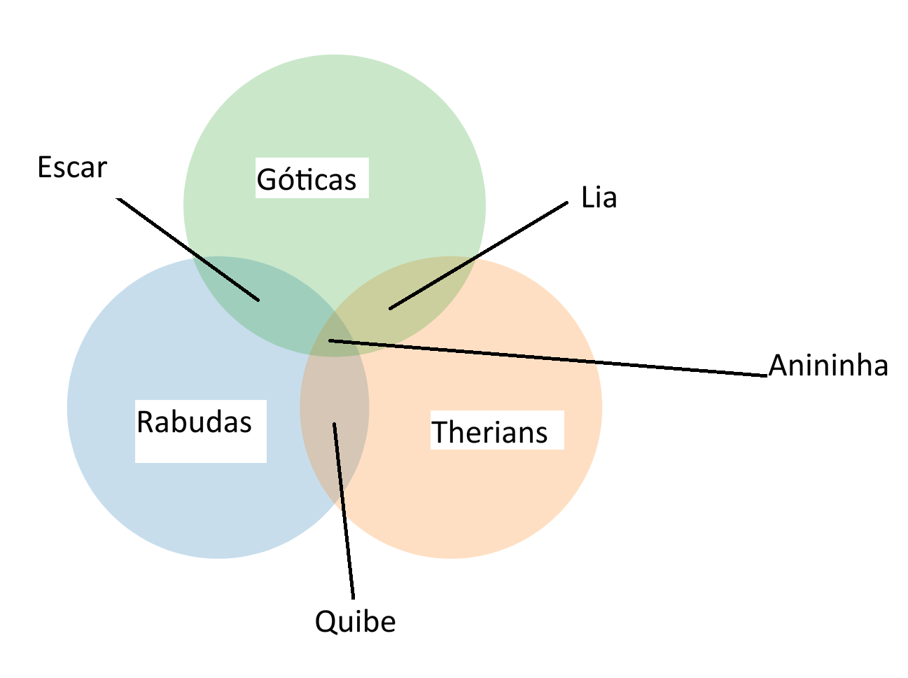

# 🎯 Diagrama de Venn Interativo

Um visualizador interativo de diagramas de Venn com 3 conjuntos, desenvolvido com **JavaScript + D3.js**, focado em clareza visual, controle manual e interatividade.

---

## ✨ Funcionalidades

* 🔵 Visualização de 3 conjuntos (A, B, C)
* ✏️ Labels totalmente editáveis
* 🎯 Setas customizadas apontando para interseções
* 🧠 Layout hardcoded estável (sem bugs matemáticos)
* 🖱️ Interação por clique e hover nas regiões
* 🎨 Design limpo e fácil de adaptar

---

## 📸 Preview



---

## 🚀 Como usar

### 1. Clone o repositório

```bash
git clone https://github.com/seu-usuario/diagrama-venn-interativo.git
```

### 2. Abra o projeto

Abra o arquivo abaixo no navegador:

```bash
index.html
```

---

## 🛠️ Tecnologias utilizadas

* HTML5
* CSS3
* JavaScript (ES6+)
* D3.js

---

## 🧩 Estrutura do projeto

```
diagrama-venn-interativo/
  ├── index.html
  ├── style.css
  ├── script.js
  └── preview.png
```

---

## 🧠 Decisão de design

Este projeto utiliza um layout manual (hardcoded) em vez de cálculo automático de interseções.

### Motivo

Bibliotecas automáticas podem:

* Gerar layouts inconsistentes
* Quebrar com certos valores
* Ser difíceis de customizar

### Solução adotada

* Layout fixo e previsível
* Controle total das posições
* Melhor experiência visual

---

## 🎯 Personalização

### 📍 Posição dos círculos

```javascript
const circles = [
  { x: 170, y: 230, r: 80 },
  { x: 280, y: 230, r: 80 },
  { x: 225, y: 140, r: 80 }
];
```

---

### ➡️ Setas e labels

```javascript
arrow(140, 360, 225, 230, "A∩C", {
  labelAtEnd: true,
  offsetX: 100,
  offsetY: 150
});
```

---

## 💡 Possíveis melhorias

* 📊 Exibir valores dentro das regiões
* 🎨 Temas de cores
* 🖱️ Drag & drop para labels
* 📷 Exportar como PNG/SVG
* 📱 Responsividade

---

## 🤝 Contribuição

Sinta-se livre para abrir issues ou pull requests.

---

## 📄 Licença

MIT License

---

## ⭐ Se curtir o projeto

Deixe uma estrela no repositório!
